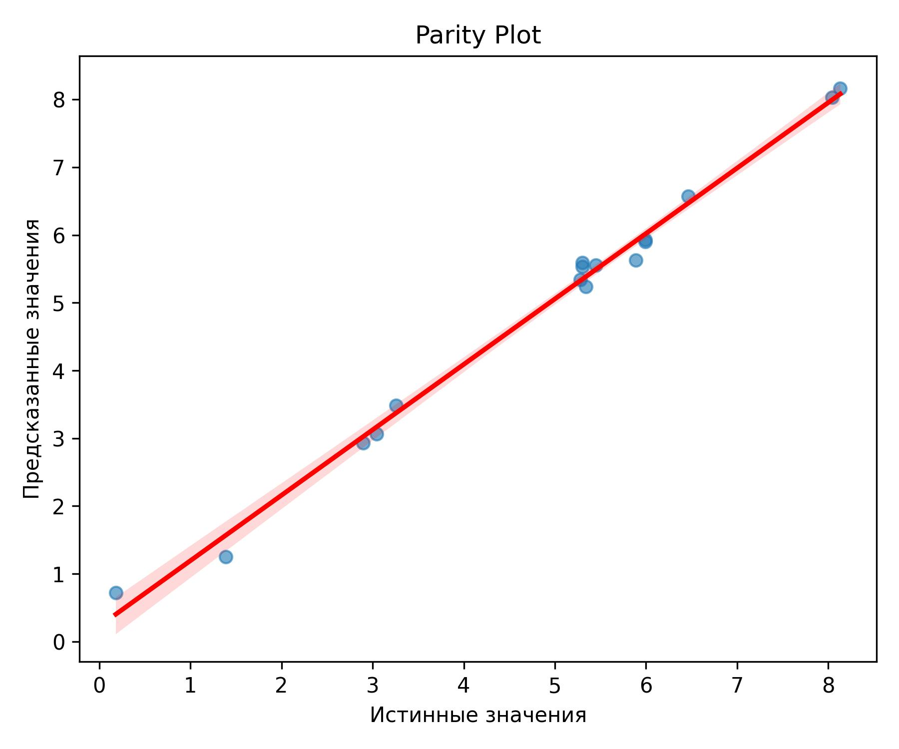
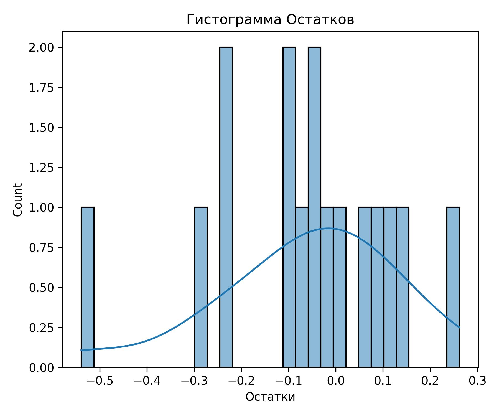
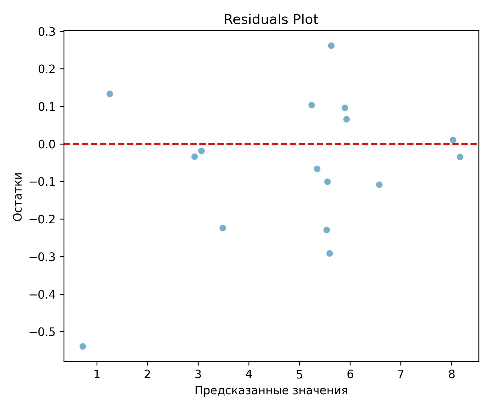

# Описание проекта: Генеративный дизайн молекул для лечения болезни Альцгеймера
## Общее описание проекта
### Цель проекта:
Создание платформы, которая поможет в организации, структуризации, и анализе результатов активности химических соединений за счет получения дополнительных дескрипторов, очистки данных, предобработки и статистического анализа, а так же благодаря внедрению ИИ.
### Проект выполнили:
Кутявин Кирилл
## Описание структуры проекта
- Корневая папка
  - `main.py` - Главный файл.
  - `Telegram.py` - Запуск и работоспособность Телеграм-бота.
  - `pipeline.py` - Пайплайн для парсинга, обработки, очистки, сохранения и построения графиков.
  - `cleaning.py` - Функции, отвечающие за очистку данных
  - `requirements.txt` - Зависимости (вообще все).
- data - все изначальные и полученные данные
  - `Chem.db` - БД SQLite, содержащая таблицы с дескрипторами к таргетам:
      - "Descriptors" - с данными после получения дескрипторов.
      - "Results" - с данными после очистки.
  - `data.csv` - Исходный файл.
  - `new` - DF с новым, вводимым веществом.
- dist - Прочие файлы, используемые при выполнении пайплайна.
- plots - Последние и актуальные графики.


## Запуск программы
### Telegram.py
- Необходимо ввести свой токен в 15 строку `TOKEN = 'YourToken'`, запустить файл и в своем боте написать ```/start```
- Если нет желания возиться с токеном, попросите меня(автора) запустить бота `@TrippyBubbleBot`, после чего введите команду `/start`
### main.py
- Запустить файл.

## Работоспособность ⚠️ Код не дописан и целиком может не функционировать. Все функции проверялись в `.ipynb` отдельно, но не цельно
Пайплайн был создан при помощи `Prefect`


Графики метрик обученной модели





#### Метрики: 
- Максимальное значение в X: 10131421542.04
- MSE: 0.04
- R2: 0.99

## Выполнение задач


### 1. Выбор мишени и датасетов
#### Обоснование выбора мишени.
Мишенью была выбрана Glycogen synthase kinase-3 beta (GSK3-β). Активность GSK-3 связана с обоими патологическими признаками болезни Альцгеймера, а именно с накоплением амилоида-β (Aβ) и образованием нейрофибриллярных клубков. Считается, что GSK-3 напрямую способствует выработке Aβ и связана с процессом гиперфосфорилирования тау-белков, который приводит к образованию клубков.
Так же этот фермент активно учавствует в формировании инсулинорезистентности головного мозга, что имеет второе название - Сахарный диабет 3-го типа. Формирование такого диабета так же способствует ускорению формирования болезни Альцгеймера.
Таким образом, инактивировав данный фермент, либо увеличив его kM, мы сможем как уменьшит излишнее фофсолирирование тау-белков, так и снизить риск возникновения сахарного диабета 3-го типа.

#### Датасеты.
База данных по активности молекул по отношению GSK3-β была получена с сайта ChemBL. Данный датасет напрямую скачивался при помощи API сайиа ChemBL в `.csv` формате и далее использовался в коде. Нашими целевыми признаками было все, что связано с ингибирвоанием фермента.

##### Парсинг дескрипторов
###### RDkit
Получение всех возможных дескрипторов с помощью ```Descriptors.descList```.
###### PubChemPy
Добавление дескрипторов, которые уникальны для PubChemPy:
```properties = ['XLogP',                # Коэффициент распределения октанол-вода (логарифмическое значение)
    'ExactMass',            # Точная масса
    'MonoisotopicMass',     # Моноизотопная масса
    'TPSA',                 # Полярная площадь поверхности
    'Complexity',           # Сложность структуры
    'Charge',               # Заряд молекулы
    'HBondDonorCount',      # Количество доноров водородных связей
    'HBondAcceptorCount',   # Количество акцепторов водородных связей
    'RotatableBondCount',   # Количество вращаемых связей
    'HeavyAtomCount',       # Количество тяжелых атомо
    'IsotopeAtomCount',     # Количество атомов изотопов
    'AtomStereoCount',      # Общее количество стереоатомов
    'DefinedAtomStereoCount',   # Определенное количество стереоатомов
    'UndefinedAtomStereoCount', # Неопределенное количество стереоатомов
    'BondStereoCount',          # Общее количество стереосвязей
    'DefinedBondStereoCount',   # Определенное количество стереосвязей
    'UndefinedBondStereoCount', # Неопределенное количество стереосвязей
    'CovalentUnitCount'        # Количество ковалентных единиц
```

#### Предобработка данных
- Дубликаты удаляются
- Если в столбце 20% пропусков - удаляем их, так как это высоко для нашей сферы применения.
- Если в столбце менее 20% пропусков, заполняются средним значением.
- Удаляются строки, если хоть одно значение в его дескрипторах является выбросом.
- Столбцы с дисперсией ниже 0.1 удаляются.

#### Определение и обоснование метрик качества данных.
- Визуализация проводилась с использованием Seaborn
- Построение графика кореляции
- Тест анализа различий между группами данных
- ANOVA, для сравнения этих групп


#### Разработка базы данных для хранения данных.
##### SQLite
- Папка `data` - все изначальные и полученные данные
  - `Chem.db` - БД SQLite, содержащая таблицы:
      - "Descriptors" - с данными после получения дескрипторов.
      - "Results" - с данными после очистки.

  
### 2. Выбор генеративной модели

#### Random Forest
Для генерации молекул была выбрана модель случайного леса, которая была обучена на специализированном датасете химических соединений с известными биологическими активностями. Использование дообучения позволило адаптировать базовую модель под специфику таргета — GSK3-β, что улучшило точность предсказания активности. В ходе дообучения мы оптимизировали ключевые свойства молекул, влияющие на эффективность и безопасность — активность, синтезируемость, drug-likeness и токсичность.

#### Плюсы
Выбор случайного леса обусловлен его устойчивостью к переобучению, высокой интерпретируемостью и способностью эффективно работать с небольшими и средними по размеру наборами данных.
Случайный лес не требует значительных вычислительных ресурсов и позволяет быстро получать предсказания. Кроме того, модель демонстрирует хорошую способность захватывать нелинейные зависимости между структурными признаками молекул и их биологической активностью. Ну и еще мне было быстрее взять то, что у меня уже было написано и адаптирвоать, чем пытаться с нуля научить другую бустинговую модель.

### 3. Финальные кандидаты
Мы не смогли получить молекулы, которые бы удовлетворяли требованиям по токсичности, легкости синтеза и прочее. Да собственно и не особо оставалось много времени на это. Здоровый сон важнее всего.